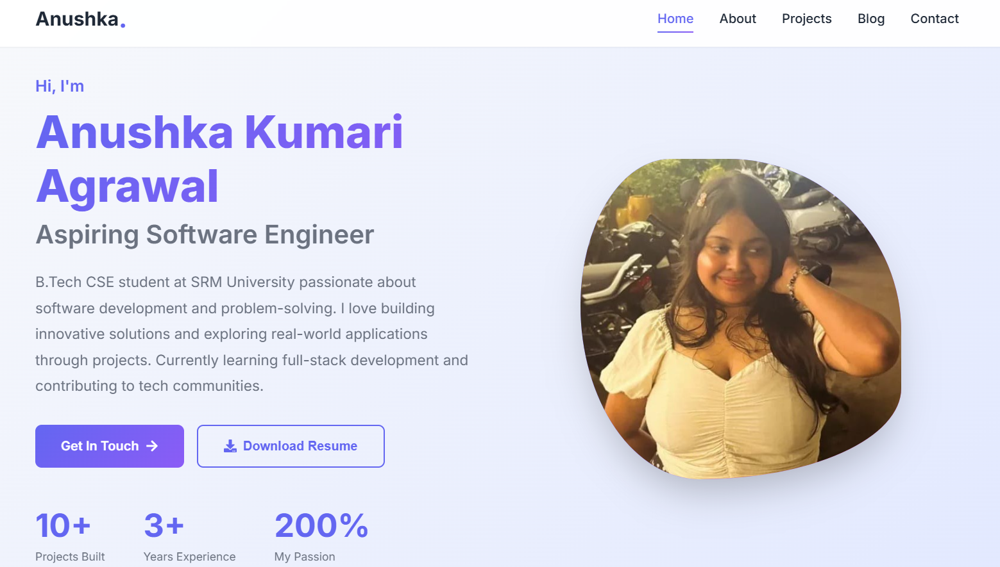
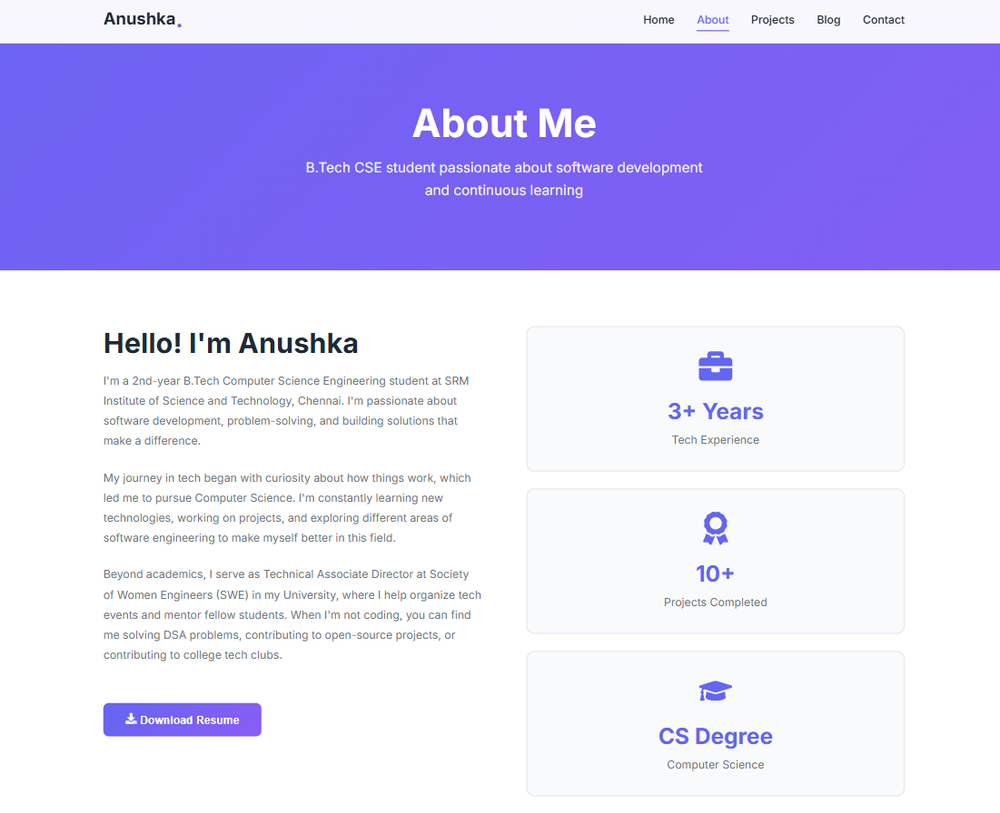
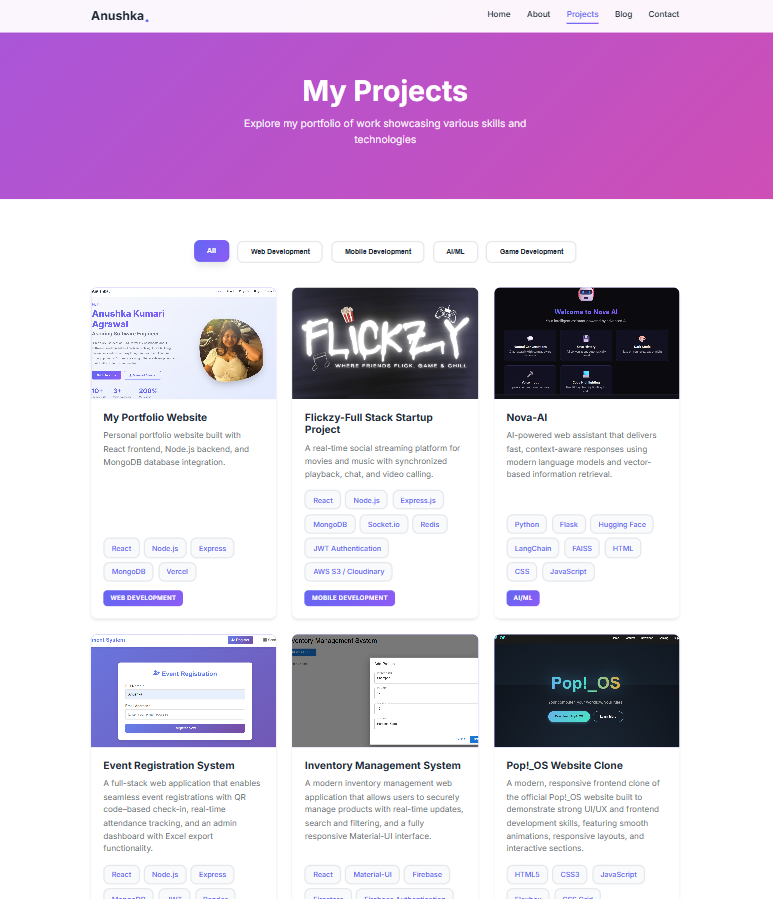
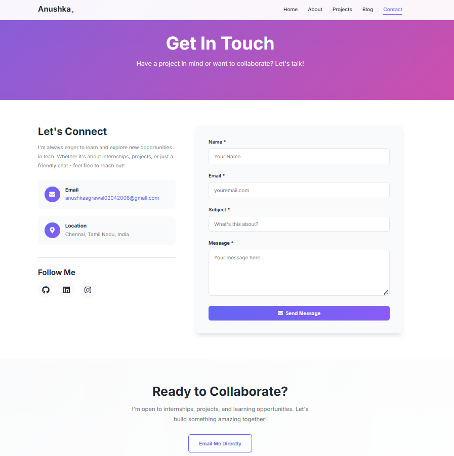

# 🌟 Anushka Kumari Agrawal - Portfolio

Hi! I’m **Anushka Kumari Agrawal**, a B.Tech CSE student and aspiring software engineer.  
This is my **full-stack portfolio website**, showcasing my projects, skills, and experience.

---

## 🚀 Live Demo

**Portfolio**: [anushka-portfolio-2006.vercel.app](https://anushka-portfolio-2006.vercel.app/)

---

## ✨ Features

- 📱 Fully Responsive Design — Mobile, Tablet & Desktop  
- 🎨 Modern UI/UX — Clean, professional interface  
- 💼 Projects Showcase with live demos & GitHub links  
- 🛠️ Skills Overview — Web + CS fundamentals  
- 📄 Resume Download  
- 📧 Contact Form with backend integration  
- ⚡ Fast Performance & Smooth Animations  

---

## 🛠️ Tech Stack

### Frontend
- React.js  
- CSS3 / Tailwind CSS / Styled Components  
- React Router    
- Deployment: Vercel

### Backend
- Node.js  
- Express.js    
- Deployment: Render  

---

## 🖼️ Portfolio Screenshots

### Home Page

### About Page

### Projects Page

### Blog Page

### Contact Page

---

## 👤 Author

**Anushka Kumari Agrawal**

- **Portfolio:** [anushka-portfolio-2006.vercel.app](https://anushka-portfolio-2006.vercel.app/)
- **GitHub:** [@anushkaagr-2006](https://github.com/anushkaagr-2006)
- **LinkedIn:** [linkedin.com/in/anushkaaaa-agrawal](https://www.linkedin.com/in/anushkaaaa-agrawal/)
- **Email:** anushkaagrawal02042006@gmail.com

---

Made with ❤️ by **Anushka Kumari Agrawal**

